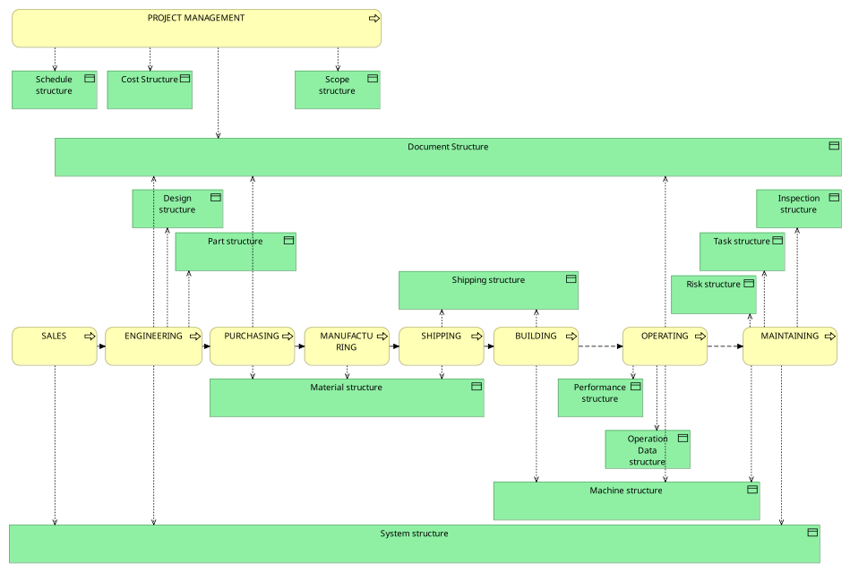

### The Nature of Decompositions

A key aspect of decompositions is that they are goal-oriented. Alongside the goal, there is usually a method or process for carrying out the decomposition, and they are relevant in a certain context. A few examples will help illustrate this:

**Location Decomposition in Construction Sites**

Construction sites are often divided into a grid of 10-by-10 meter squares to prevent multiple activities from occurring in the same location simultaneously. This is based on the principle that construction work often takes place at a certain elevation, and activities such as welding at 20 meters, for example, can create hazardous conditions below the work area. Linking the 10x10 meter grid elements to the planned activities helps mitigate these hazards for on-site workers.

The goal here is to avoid hazardous conditions, and the method is to divide the site into a 10x10 meter grid in areas where construction work is being performed. The context is a construction site during the build phase.

**Work Breakdown Structure (WBS)**

This is one of the most common applications of decomposition: project planning. A complex task is divided into smaller, more manageable tasks, which are then allocated to the teams responsible for carrying out the work.

The goals here include:

* **Enhanced Project Control:** Smaller, more manageable tasks allow for better progress tracking and early identification of potential roadblocks. This facilitates timely adjustments and minimizes the risk of project delays.

* **Improved Resource Allocation:** By understanding the specific requirements of each sub-task, resources (time, budget, personnel) can be allocated more effectively.

The method used typically involves:

* Dividing tasks into sub-tasks that are small enough to be completed within a specific timeframe
* Dividing tasks in a way that clarifies dependencies between them
* Dividing tasks according to required skill levels
* Ensuring each task has a clear deliverable
* Defining clear acceptance criteria for completed tasks

The context is project management; the decomposition is relevant for the project management team.

> **Important:** In general, a good decomposition is defined by a clear goal (or set of goals), a method that guides the creation of the individual decomposition elements, and a definition of its context.

The following sketch may clarify this somewhat more. It shows the structures (in most cases, decompositions) that were used in the creation, operation, and maintenance of large industrial equipment.

From the sketch, it will be clear that the context can be bounded by phases but can also be bounded by business processes.
