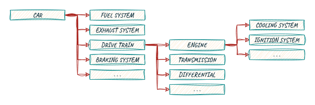
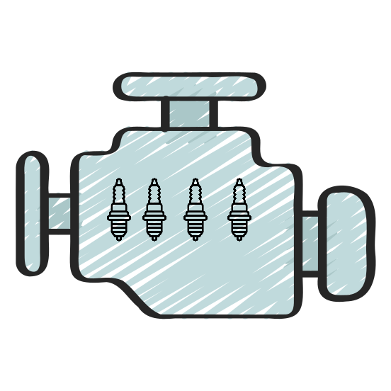
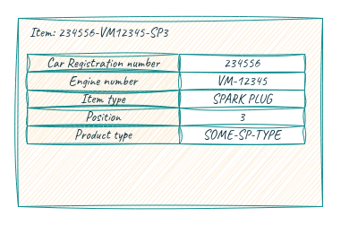
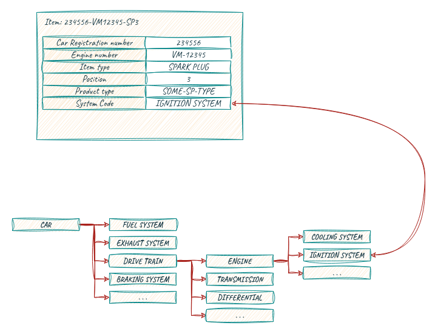

### The Relationship Between Decompositions

As we have seen, multiple simultaneous decompositions can (and usually will) exist. An interesting question is: are they related, and if so, how?

**Decompositions and Instances**

It is important to note that decompositions are imaginary constructs. They are not real. The entire structure is something we make up to facilitate understanding. In general, we link a decomposition element to something in the real world at some point.

For example, consider the drivetrain of a car, where the first level of a decomposition could be:
- Engine
- Transmission
- Driveshaft
- Differential
- Axles
- Wheels

The engine could be further composed of:
- Cooling system
- Ignition system
- And so on

The sketch below shows a slightly more detailed decomposition:

  
*Decomposition example; all arrows indicate a hasPart relation.*

In my car (the one parked in front of my house), there is an actual engine with a serial number (for example, VM12345). The engine contains four spark plugs, one for each cylinder.

{: width="250" }  
*Decomposition of the spark plugs in my car.*

In semantic terms, the actual spark plugs would be the instances. They have a number (plug 1–4) corresponding to the cylinder number and are part of the engine with serial number VM12345.

In general, we link instances to decomposition elements. These instances are real-world objects that we connect to a decomposition element.

The information we now have about spark plug 3 is:

{: width="500" }

The way to connect this instance to the decomposition above is by adding a new field with a value that points to the correct decomposition element.

> **Note:** There are a few things to clarify. First, we're assuming that a spark plug can also be used in something that is not a car (like a motorcycle). Otherwise, we could have simply added the spark plug to the decomposition. A drawback of this approach is that the decomposition must be absolutely complete and accurate for the domain; otherwise, data entry for unforeseen cases becomes impossible. In general, the more robust approach is to allow the user to choose a decomposition element and, given that users make mistakes, to check for entries that are unusual.  
>
> Secondly, we're assuming that each individual spark plug will have data. This only makes sense if there is a reason to monitor or maintain each plug individually. If we were to replace all of them at the same time, and replace them all if one is faulty, then we would probably be treating the plugs as a group.

### Linking Decompositions Over Instances

The previous example showed a single decomposition coupled to an instance. We can easily extend that by adding multiple fields that reference different decompositions. This technique is sometimes called multiparenting. Another term that is occasionally used is dimensions (which can be similar to the dimensions seen in snowflake-based data lakes).

 
 
