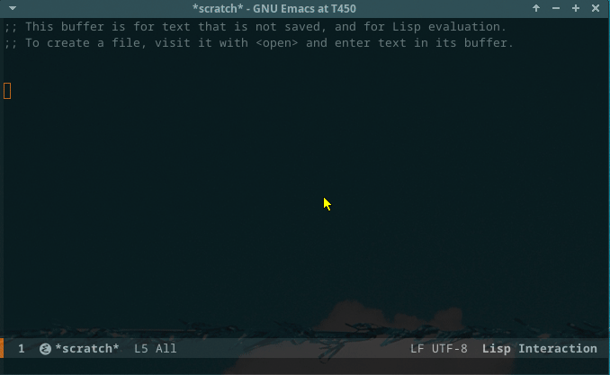
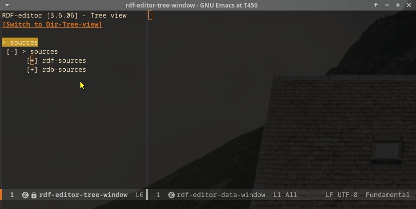
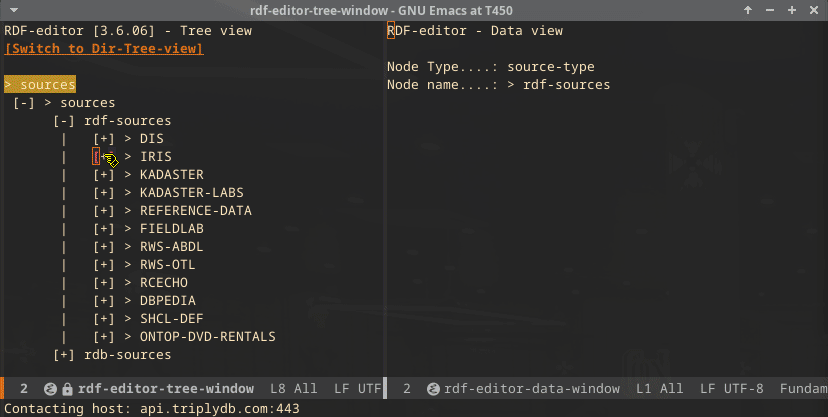
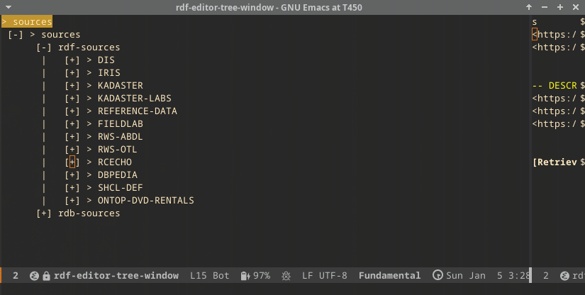
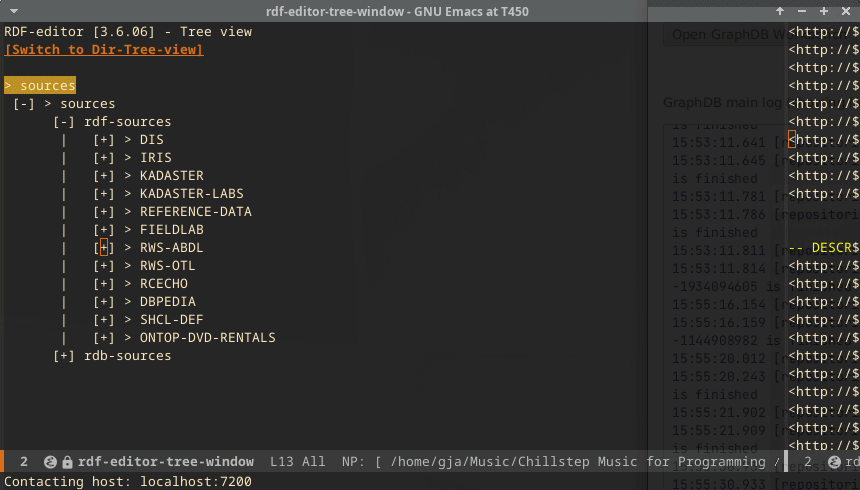
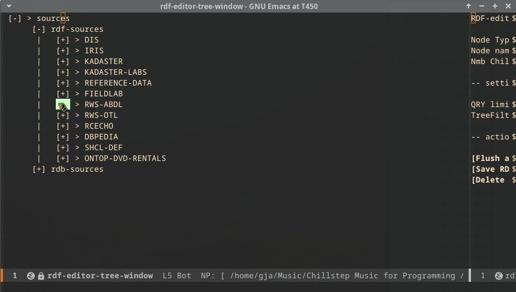
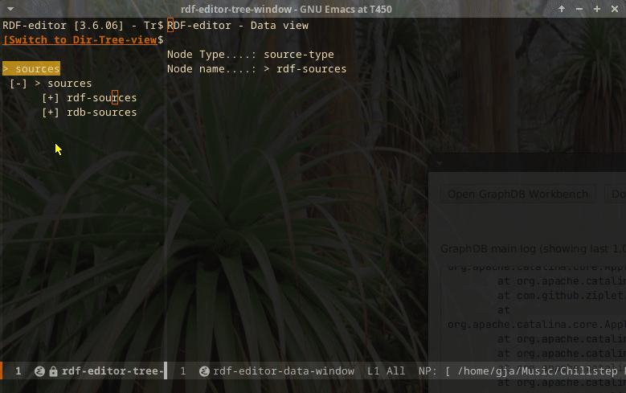
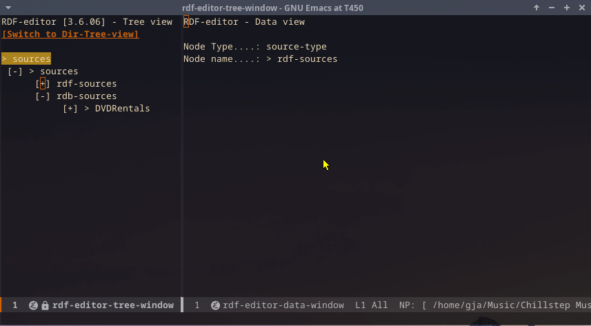

## RDF editor in action

### Startup
When starting the editor, the following screen is shown:

### Tree expansion
Both main data sources can be expanded. They show the configured data sources. Here, we show the IRIS data source, which is a publicly accessible store.

An RDF source can be expanded by clicking the + symbol. The first
levels that are shown are the graphs in the store. In the screencast
below, this is the DEFAULT level below the IRIS level.

Further expansion leads to the entrypoints, which are configurable.

The entrypoint will first show the top elements, and then the levels
below the top. As an example, when expanding the classes entrypoint,
first the classes that have no 'super' class will be selected. Then,
when one of the shown classes is expanded, the subclasses will be
shown. This is the default expansion mechanism.

### Data window

When clicking the label control in the tree, the data window shows detailed information taken from the store for the subject.

In the above screencast, the part of the data window that is populated
by the SHACL definition is indicated. The page shows (separately) the
triples that are part of the subject but are not part of the SHACL
definition (under the heading "unshackled triples"). The screencast
also shows the depiction of the triples that point to an image. These
images are fetched and rendered in the editor.

### GeoLocation

The following screencast shows the geo-location functionality. It uses
an RDF store for cultural heritage in the Netherlands. The screencast
shows the descent in the tree to the points-graph, where the descent
is continued over the available instances. When selecting an instance,
the button "Show GeoLocation" is used, which opens up an OpenStreetMap
display inside the editor.

### Multistore access

The screencast below shows the expansion of a store called ABDL[^1],
which is stored inside a local GraphDB database. The interesting part
here is that (in the previous screencasts) the IRIS and the RCECHO
stores are located somewhere on the internet. Some of the other stores
in the tree are local Fuseki stores. Access is transparent. If needed,
there are separate drivers (for example, for GraphDB a special driver
was needed). Also shown here: the concept expansion mechanism, which
can be quite extensive, as can be seen here.

### Namespace switching

It is possible to configure the store where a namespace is
located. This enables a namespace switch during the descent. The
switch is completely transparent and made possible because of the
multistore access.

### Editing
In the screencast below, basic editing is shown. The edits are directly made against the database.

### Loading data

The editor allows loading data into the store, specifying the graph,
or when data is loaded as a .trig, loading the data as indicated in
the .trig. It also allows clearing graphs and, as it remembers the
loaded files, quickly reloading the store.

### Treeview
The editor allows switching to a directory treeview and back to the RDF editor.

### Relational data analysis

It is possible to configure relation stores to analyze, as long as they are Postgres databases. The following screencast indicates the possibilities.

### Searching and SPARQL

In the below screencast, first, sending a SPARQL query to the store is
shown. The SPARQL code is beautified by using the SPARQL mode, and the
store/port information is taken from the configured store in the RDF
editor. After that, searching is shown. Because the resolution cannot
be made big enough, the fields are compressed. But there are four
fields: subject, predicate, object, and graph.

- If graph is entered, this graph will be used to answer the query. If
  it is not entered, the query will be done over the entire store, and
  the result lines will indicate the graph where the triple originated
  from.

- If, for subject, predicate, and object, an IRI is entered, the IRI
  is used. However, if a general string value is used, a CONTAINS
  query is performed, returning all triples that contain the string
  (as part of the IRI or as a literal).

---
[^1] <small> The original ABDL can be accessed here: [BegrippenXL](https://www.begrippenxl.nl/ABDL/nl/).</small>