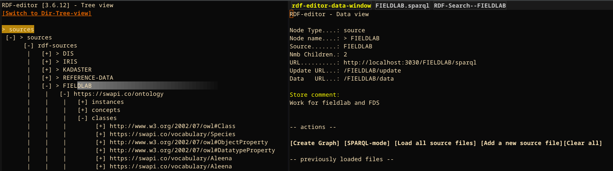
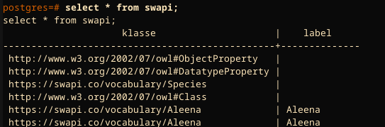

## RDF Foreign Data Wrapper ##

[rdf_fdw](https://github.com/jimjonesbr/rdf_fdw) is a
[PostgreSQL](https://www.postgresql.org/) extension that creates
virtual database tables inside a PostgreSQL database. The tables are
based on SPARQL queries to an RDF store. The queries are converted on
the fly, and the results are fetched from the store and converted to a
response to an SQL query on the tables in real time. This process is
executed without any intermediate storage.

There is support for push-down, meaning that some parts of the SQL
query are pushed down into the resulting SPARQL query. Typical
examples include sorting and filtering.

The installation guide on
[GitHub](https://github.com/jimjonesbr/rdf_fdw) is quite clear, and
you should be able to get the extension into your PostgreSQL database
easily. I’ve used it to access the [SWAPI
ontology](https://platform.ontotext.com/semantic-objects/_downloads/2043955fe25b183f32a7f6b6ba61d5c2/SWAPI-WD-data.ttl)[^1]
I installed in my local
[Fuseki](https://jena.apache.org/documentation/fuseki2/) RDF store.

The SWAPI store:



The ontology itself lives in the graph https://swapi.co/ontology.

The way to set rdf_fdw up to use this data is to first create a
server, then to create a foreign table, and finally to query the
foreign table[^2].

### Creating the server ###

``` sql
  CREATE SERVER swapi
  FOREIGN DATA WRAPPER rdf_fdw 
  OPTIONS (endpoint 'http://localhost:3030/FIELDLAB/sparql');
```

### Creating the foreign data table ###

```sql 

CREATE FOREIGN TABLE swapi (
  klasse text OPTIONS (variable '?klasse',     nodetype 'iri'),
  label text  OPTIONS (variable '?label',     nodetype 'literal', literaltype 'xsd:string')
  )
SERVER swapi OPTIONS (
  sparql '
PREFIX rdfs: <http://www.w3.org/2000/01/rdf-schema#>
PREFIX rdf:  <http://www.w3.org/1999/02/22-rdf-syntax-ns#>
PREFIX owl:  <http://www.w3.org/2002/07/owl#>
Select ?klasse ?label FROM <https://swapi.co/ontology>
WHERE { BIND(!BOUND(?parent)  as ?check) FILTER (?check) FILTER (!isBlank(?klasse))
  { SELECT ?klasse ?instcount ?label ?parent
    WHERE { { SELECT ?klasse (count(?inst) as ?instcount)
      WHERE { ?inst rdf:type ?klasse. FILTER ISIRI(?klasse) }
      GROUP BY ?klasse } UNION { ?klasse rdf:type rdfs:Class }
      UNION { ?klasse rdf:type owl:Class }
      OPTIONAL { ?klasse rdfs:label ?label }
      OPTIONAL { ?klasse rdfs:subClassOf ?parent .
	FILTER ISIRI(?parent) } } } }
'); 
 
```

This is one the base queries that RDF-Editor uses to create the treeview,

### Accessing the table using a query ###

Et voila: 



The result of the query to PostgreSQL, which was fetched in real time
from the Fuseki data store. The important part here is that the SELECT
on the RDF store can be as complex as needed. This allows for
off-loading complex multi-join queries to the RDF store, which usually
is much better at solving these kinds of queries.

### Conclusion ###

rdf_fdw is a huge step forward. Given the fact that many BI tools can
only connect to relational data stores, the ability now to access RDF
data over a relational data store in this easy way is very useful.
Combined to that: the fact that there is no intermediate storage and
no copying ensures that linked data solutions fit much better to the
the data at the source paradigm currently *en vogue* in the
Netherlands. Finally, the fact that is relatively lightweight, just an
extension in PostgreSQL make is a real attractive option.

---
[^1]: Provided by [Ontotext](https://www.ontotext.com/)
[^2]: Note that this will only work after the rdf_fdw has been
    installed in your postgresql environment. The way to do that
    is described on the github homepage of
    [rdf_fdw](https://github.com/jimjonesbr/rdf_fdw).
